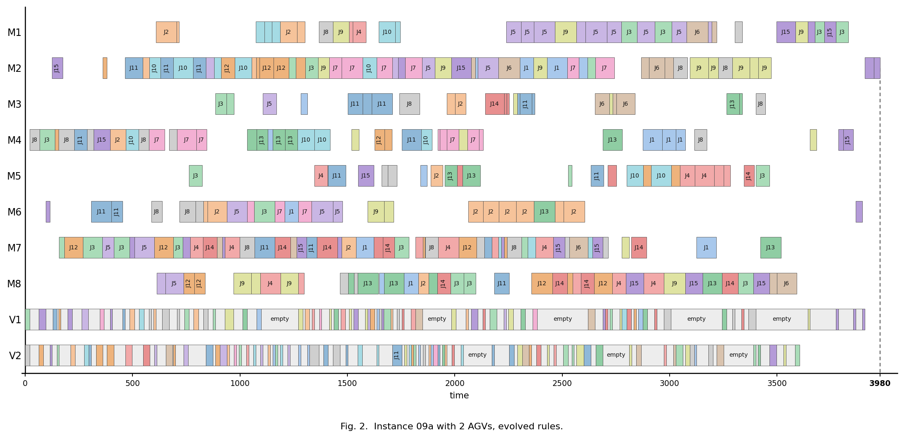
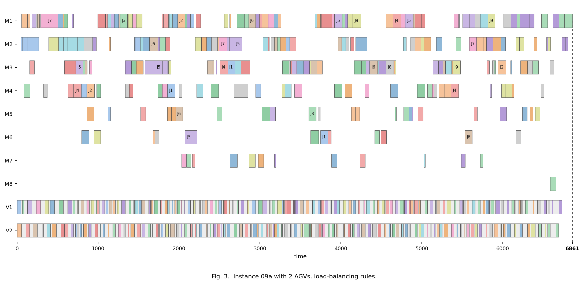
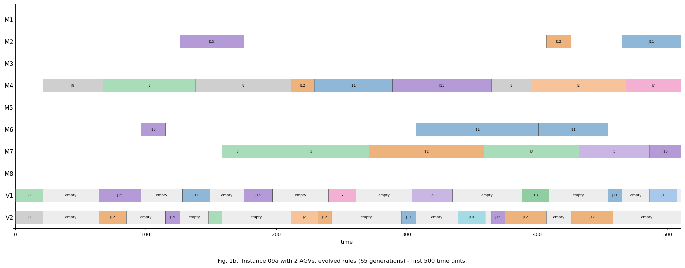
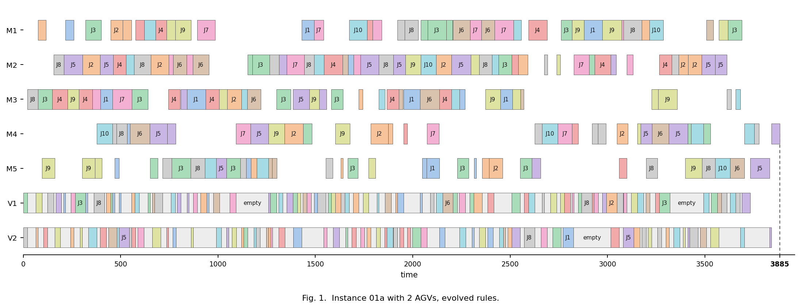
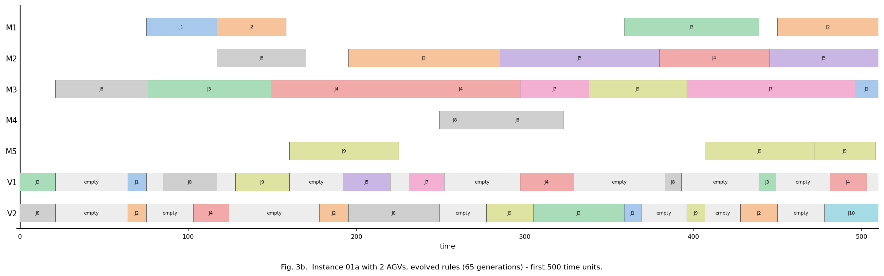

# 보고서 - 실험 폴더 정리·리팩토링, 그리고 힌트 제거 ablation

작성 2026-08-13. 코드 `model/`·`simulator/`(정리 후), `experiments/plots.py`(신규),
실험 `experiments/2026-08-13-bundle_evolution_nohint.py`,
결과 `data/results/2026-08-13-bundle_evolution_nohint_result.json`.
LLM 호출 6회, 실패 0, $2.32, 7분 10초.

## 결론

1. **시스템 프롬프트에서 "부하분산이 이긴다"는 힌트를 지웠는데도, LLM이 부하분산 뼈대를
   스스로 찾아냈다.** 네 슬롯 전부에 `-queue_len` / `-arrival` 구조가 다시 나타났다.
   -> 앞선 실행(2026-08-13 오전)의 "받아쓴 것 아니냐"는 반론에 실측으로 답한 것.

2. **성능도 떨어지지 않았다. held-out에서는 오히려 더 좋다**(4707.9 vs 4806.1, 문헌 대비
   44.7% vs 46.2%). 다만 이 차이는 n=1 두 팔의 차이라 **"힌트 없는 쪽이 더 낫다"고 주장할 수
   없다.** 주장 가능한 것은 **"힌트가 없어도 나빠지지 않는다"**까지다.

3. **두 팔이 서로 다른 것을 발견했다.** 힌트 있는 팔은 잔여작업량(`remaining_ops`,
   `remaining_proc`)에 작은 계수를 얹었고, 힌트 없는 팔은 **이동거리 항**(`travel_to`,
   `empty_travel`, `agv_cum_travel`)을 얹었다. 후자는 GA 시대 2x2 ablation에서 주효과로
   판명됐던 **공차(empty_travel) 최소화**를 구성형 체제에서 독립적으로 재발견한 것이다.

4. **`model/`·`simulator/`를 지금 방법에 필요한 것만 남기고 정리했다**(7->4, 12->8 모듈).
   GA·LNS 계열은 그 캠페인 스크립트 11개와 함께 `archive/ga-era/`로. 리팩토링이 동작을
   바꾸지 않았음은 **저장된 번들 재평가가 소수점까지 일치**하는 것으로 확인했다.

5. **여전히 문헌을 못 이긴다**(44.7%는 양수). 이건 이번 실험이 바꾼 게 아니다.

## 1. 무엇을 왜 했나

앞선 실행(`2026-08-13-bundle-evolution-first-run.md`)에서 4슬롯 진화가 처음 돌았고,
held-out 15개에서 손규칙 시드를 전부 이겼다. 그런데 그 실행에는 약점이 하나 있었다:
**시스템 프롬프트에 "부하분산이 교과서 그리디를 2배 이상 이긴다"는 측정 사실이 힌트로
박혀 있었다.** 결과 번들이 부하분산 뼈대를 유지했으므로, "LLM이 발견한 것"인지
"우리가 알려준 것을 받아쓴 것"인지 그 실행만으로는 구분할 수 없었다.

이번 실행은 **그 문단만 지우고 나머지는 전부 동일**하게 두었다. 같은 시드 3개, 같은
population 20, 같은 6세대, 같은 학습 3인스턴스. 즉 단일 변수 비교다.

동시에, 방법이 구성형으로 확정되면서 `model/`·`simulator/`에 안 쓰는 코드가 쌓여 있었다.
실험 폴더는 "지금 돌리는 데 필요한 것"만 담도록 정리했다.

## 2. 정리 (archive)

실제 import 그래프(AST 기준, grep 아님)로 판정했다. `git mv`로 옮겨 히스토리는 보존된다.

| 옮긴 것 | 어디로 | 왜 |
|---|---|---|
| `agv_fms.py`, `policies.py`, `rule.py` | `archive/a-track/` | 동적 A안 엔진. live 트리에서 참조 0 |
| A안 LLM proposer (`llm_proposer_atrack.py`) | `archive/a-track/` | mean tardiness용 (agv, machine) 쌍 진화 |
| `ga.py`, `evaluator.py` | `archive/ga-era/` | 해 수준 탐색. 구성형에서 안 씀 |
| `lns.py` | `archive/ga-era/` | 2026-08-10 게이트에서 기각 |
| `replay.py` | `archive/ga-era/` | Dauzere 해 파일이 54/54 헤더 불일치라 사용 불가 |
| 단일규칙 proposer (`llm_single_rule.py`) | `archive/ga-era/` | vehicle_select 한 슬롯만 진화. 4슬롯이 대체 |
| `test_ga_operators.py`, `test_decode_selfcheck.py` | `archive/ga-era/` | 위 코드들의 게이트 |
| 캠페인 스크립트 11개 | `archive/ga-era/` | 위 코드에 의존. 남기면 import 깨진 채 방치됨 |

결과:

```
model/       experiment.py  llm.py  llm_backend.py  rules.py            (7 -> 4)
simulator/   dispatch.py  instance.py  solution.py  timing.py
             + 게이트 3종                                                (12 -> 8)
experiments/ common.py  plots.py  test_reported_numbers.py + 캠페인 3개
```

`archive/ga-era/README.md`에 무엇이 왜 은퇴했고 되살리려면 어떻게 하는지 적어뒀다.
**되살리기보다 `experiments/plots.py`에 비교용 코드를 따로 쓰는 것이 방침이다.**

## 3. 리팩토링 (동작 보존)

- `model/experiment.py` 199 -> 106줄. GA 기반 `evolve`/`evaluate_rule`/`compare` 제거,
  구성형 `evolve_bundle`/`evaluate_bundle`만 남김.
- `model/llm.py` 400 -> 198줄. 단일규칙 proposer 분리.
- `model/llm_backend.py` 312 -> 85줄. A안 proposer를 걷어내고 **CLI 백엔드만** 남김
  (`_ExprProposer` 상속 제거, 예산·계정 필드는 `ClaudeCliLLM`으로 인라인).
- **날짜·이력 주석 제거**: live 코드 26건 -> **0건**. 근거(rationale)는 남기고 날짜만 뺐다.
  예: "이 게이트가 2026-08-07에 8/10을 잡았다" -> "자원이 유휴로 기다릴 수 있어야 한다".
- **한글 주석·출력 전부 영문화**(논문 공개 대비). 게이트 출력 문구만 바뀌고 판정은 동일.

### 검증

리팩토링이 계산을 건드리지 않았음을 두 가지로 확인했다.

| 게이트 | 결과 |
|---|---|
| **결정성**: 저장된 번들 재평가 | train `5953.666666666667`, test `4806.133333333333` - **저장값과 완전 일치** |
| `simulator.test_paper_example` | PASS (논문 워크드 예제 Cmax 13) |
| `simulator.test_replay_deroussi` | PASS (공표 makespan 10/10 재현) |
| `simulator.test_dispatch` | PASS (G1 자기검증 12/12, G2 강제 재현 10/10) |
| `experiments.test_reported_numbers` | PASS (보고된 수치 전부 재현) |
| LocalBundleProposer 스모크 | 리팩토링 전과 동일한 궤적 (7122 -> 6933.33) |

## 4. 실험 - 힌트 제거 ablation

### 세대별 진행 (train 3인스턴스 평균 Cmax)

| 세대 | 힌트 있음 | 힌트 없음 |
|---|---:|---:|
| 0 (시드) | 7122.0 | 7122.0 |
| 1 | 6818.7 | 6670.3 |
| 2 | 6691.3 | 6342.0 |
| 3 | 6691.3 | 6144.3 |
| 4 | 6269.7 | 6040.0 |
| 5 | 6005.7 | 5998.7 |
| 6 | **5953.7** | **5974.0** |

힌트 없는 쪽이 초반에 더 빨리 내려가고 끝에서 살짝 뒤집힌다. 두 궤적의 차이는 작다.

### 최종 번들 (힌트 없음)

```
machine_select: -queue_len - 2*travel_to - proc_time
op_sequence:    -arrival - 0.5*proc_time + 2*remaining_ops
vehicle_select: -queue_len - empty_travel - agv_cum_travel
task_sequence:  -arrival + 3*remaining_ops
```

**부하분산 뼈대(`-queue_len`, `-arrival`)가 네 슬롯에 그대로 살아 있다.** 힌트 없이.
그 위에 얹힌 것은 **이동거리 항**이다: 기계 선택에 `travel_to`(그 기계까지 가는 거리),
차량 선택에 `empty_travel`(공차) + `agv_cum_travel`(누적 이동).

비교 - 힌트 있던 팔이 찾은 것:

```
machine_select: -queue_len + 0.01*remaining_ops - 0.003*travel_to
op_sequence:    -arrival + 0.045*remaining_ops + 0.01*wait + 0.005*idle
vehicle_select: -queue_len - 0.003*empty_travel
task_sequence:  -arrival + 0.045*remaining_proc + 0.01*wait
```

같은 뼈대 + 아주 작은 계수(0.003~0.045)의 잔여작업량 항. **힌트가 없을 때 오히려 이동거리를
더 크게(계수 1~3) 반영했다.**

### held-out 15개 (진화 중 미접근)

| 규칙 번들 | 평균 Cmax | 문헌 대비 격차 | BALANCED 대비 |
|---|---:|---:|---:|
| **evolved (힌트 없음)** | **4707.9** | **44.7%** | -32.9% |
| evolved (힌트 있음) | 4806.1 | 46.2% | -31.5% |
| MIX (손규칙) | 6670.7 | 105.2% | -4.9% |
| BALANCED (손규칙) | 7011.6 | 115.8% | +0.0% |
| HAND (손규칙) | 9939.2 | 205.8% | +41.8% |

인스턴스별 승수 (힌트 없는 팔 기준): BALANCED **15/15**, HAND **15/15**, MIX **13/15**,
힌트 있는 팔 **9/15**.

### Gantt

held-out 인스턴스 09a(8기계·15job·AGV 2대)에서, 같은 문제를 두 규칙이 어떻게 푸는가:





같은 인스턴스인데 **3980 vs 6861**이다. 눈에 띄는 차이는 **AGV 행(V1·V2)의 회색 구간
= 공차/대기**로, 손규칙 쪽이 훨씬 길다. 진화된 규칙이 `empty_travel`과 `agv_cum_travel`에
벌점을 준 것이 그림에서 그대로 보인다. 기계 쪽도 손규칙에서는 M5~M8이 거의 놀고 있다.

전체 차트는 규모가 커서 짧은 공정에 라벨이 들어가지 않으므로, **핵심 결과(진화 번들)는
앞 500 시간단위를 확대한 그림을 함께 낸다.** 확대하면 어느 job이 어디 있는지 전부 읽힌다.
BALANCED 쪽은 전체 차트에서 이미 M5~M8 유휴가 명확해서 확대가 새 정보를 주지 않으므로 생략:



학습 인스턴스 01a:





## 5. 해석

- **"LLM이 스스로 발견했다"가 이제 실측으로 뒷받침된다.** 힌트를 지운 팔이 같은 구조에
  독립적으로 도달했다. 이건 논문에서 방법의 정당성을 세우는 데 직접 쓸 수 있는 증거다.
- **공차 최소화의 재발견이 흥미롭다.** GA 시대 2x2 ablation(2026-07-24)에서 진화 규칙의
  진짜 주효과는 "결합 통찰"이 아니라 `empty_travel` 벌점이라고 판명됐었다. 완전히 다른
  체제(구성형·4슬롯·힌트 없음)에서 같은 것이 다시 나왔다. **서로 다른 두 실험 설정에서
  같은 물리적 통찰이 재현된 것**이라 우연으로 보기 어렵다.
- 힌트를 넣는 것이 오히려 탐색을 **좁혔을** 가능성이 있다. 힌트가 있던 팔은 계수가
  0.003~0.045로 미미해서 사실상 시드에서 거의 안 움직였다. 다만 n=1이라 가설 수준이다.

## 6. 주의 (다음 세션 필수)

- **각 팔 n=1.** 두 팔의 성능 차이(44.7% vs 46.2%)는 LLM 샘플링 노이즈로 설명 가능한
  크기다. **"힌트 없는 쪽이 낫다"고 쓰면 안 된다.** 쓸 수 있는 것은 (a) 부하분산 뼈대의
  독립 재발견, (b) 힌트 제거가 성능을 해치지 않음, 두 가지다.
- **정량 주장을 하려면 팔당 3회 이상**이 필요하다. 회당 약 $2.3, 7분이므로 6회 = 약 $14.
- 여전히 문헌 대비 44.7%. **문헌을 이긴 인스턴스는 0개다.**
- AGV 2대·Dauzere 계열만 봤다. 4·6대와 Deroussi 10개(zero-shot 전이)는 미측정.
- `evolve_bundle`에는 **교차 연산자가 없다**(LLM 변이만). STATUS.md 계획의
  "교차 = 슬롯 단위 재조합"은 여전히 미구현이다.

## 관련 파일

- `experiments/2026-08-13-bundle_evolution_nohint.py` - 이번 실행 (프롬프트에 힌트가
  남아 있으면 assert로 죽는다)
- `experiments/plots.py` - `gantt()`, `comparison()`, `comparison_markdown()`
- `data/results/2026-08-13-bundle_evolution_nohint_result.json` - 세대별 전체 로그 +
  이번에 쓴 시스템 프롬프트 원문
- `archive/ga-era/README.md` - 은퇴 자산 목록과 복구 방법
- 직전 보고서: `2026-08-13-bundle-evolution-first-run.md` (힌트 있는 팔)
