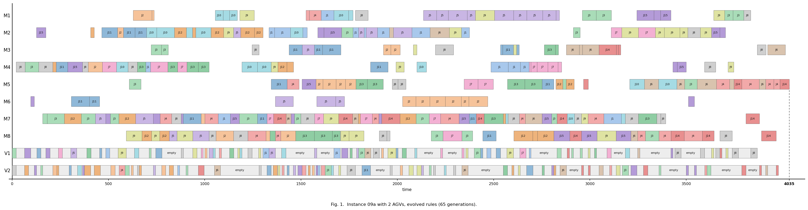
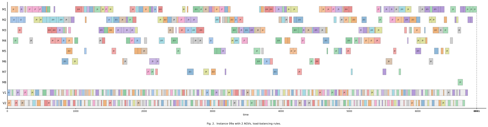
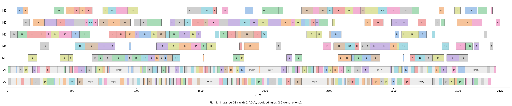
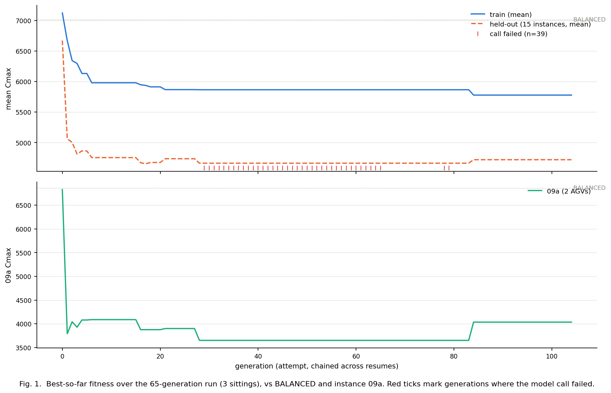
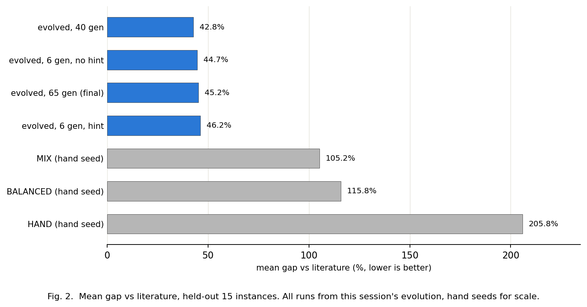
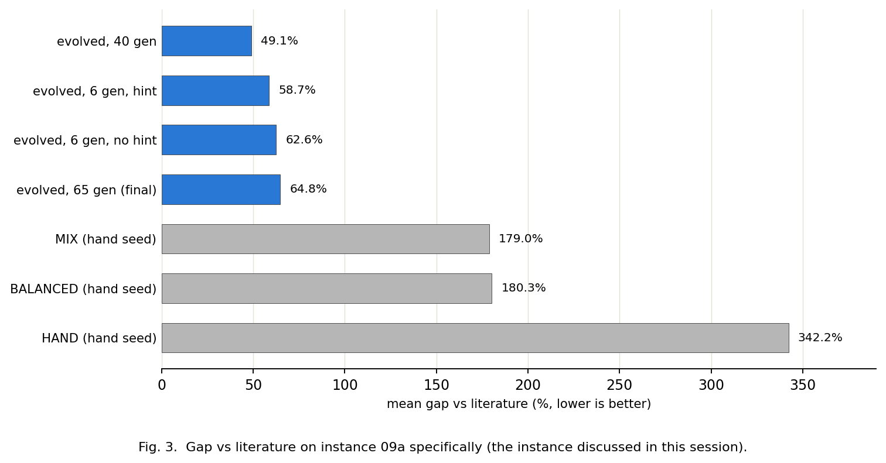

# 보고서 - 문헌 규모 예산(65세대) 완주, 그리고 과적합이 잡힌 지점

작성 2026-08-13. 실험 `experiments/007-260813-bundle-evolution/run_full.py` +
`...-bundle_evolution_resume.py`(2회). 결과
`data/results/2026-08-13-bundle_evolution_full{,_resumed,_resumed2}_result.json`.
LLM 호출 105회(그중 유효 65회), 총 $21.22.

## 결론

1. **프로토콜 예산을 채웠다: 실질 65/65 세대.** 사용량 제한으로 두 번 끊겨 3회에 나눠 돌렸다.
2. **41~65세대 구간에서 과적합이 일어났고, held-out 분리 덕에 잡혔다.**
   train(3개) 5865.7 -> 5778.0으로 **좋아지는 동안** held-out(15개)은
   4663.3 -> 4720.3으로 **나빠졌다.**
3. **원인이 규칙에서 그대로 읽힌다.** 마지막 개선이 `machine_select`에서
   **부하분산 항 `-queue_len`을 삭제**했다. 학습 3개에는 이득, 나머지 15개에는 손해.
   -> 힌트 없이 LLM이 찾아낸 부하분산 뼈대가 **일반화를 담당하던 부분**이었다는 증거.
4. **LLM이 처음으로 후보 비교 규칙(`f['_all']`)을 썼다.** 한 줄 산술식으로는 표현
   불가능한 형태이고, Han 2024의 고정 디코딩과의 차별점에 직결된다.
5. **최종 성적(gen65, held-out 15개): 문헌 대비 45.2%.** 손규칙 전부를 이긴다
   (BALANCED 15/15, MIX 14/15, HAND 15/15). 문헌은 여전히 못 이긴다.

## 1. 예산과 실행 이력

| 실행 | 로그 세대 | 유효 세대 | 누적 | 실패 | train best | held-out |
|---|---:|---:|---:|---:|---:|---:|
| 1차 | 65 | 28 | 28/65 | 37 | 5865.7 | 4663.3 |
| 재개1 | 14 | 12 | 40/65 | 3 | 5865.7 | 4663.3 |
| 재개2 | 25 | 25 | **65/65** | 0 | **5778.0** | **4720.3** |

1차는 29세대부터 끝까지 호출이 전부 실패했다(사용량 제한). 그런데 **호출이 실패하면
부모를 복사해 채우므로 루프는 계속 돌았고, 로그상 65세대 완주로 보였다.** 적합도 곡선이
28세대부터 평평한 것과 usage 경고만이 단서였다. 이후 재시도·백오프와 "연속 3세대 실패 시
중단"을 넣었고, 재개1은 그 장치에 걸려 멈췄다(의도된 동작).

## 2. 과적합

### 무슨 일이 있었나

```
gen 40  machine_select: -queue_len - travel_to
gen 65  machine_select: -travel_to - proc_time      <- -queue_len 삭제
```

이 변경으로 train 평균 Cmax가 5865.7 -> 5778.0 (**-1.5%**) 개선됐다. 같은 변경이
held-out에서는 4663.3 -> 4720.3 (**+1.2%**) 악화였다. **gen65는 gen40 대비 held-out
15개 중 3개에서만 이긴다.**

### 왜 중요한가

- 힌트를 지운 조건에서 LLM이 스스로 찾아낸 부하분산(`-queue_len`) 구조가, 실제로
  **일반화를 담당하던 성분**이었음이 사후적으로 확인된다. 그걸 버리자 학습셋만 좋아졌다.
- 이건 held-out을 진화 중 한 번도 건드리지 않았기 때문에 관측 가능했다.
  **성능 주장을 held-out에서만 한다는 규율이 실제로 값을 했다.**

### 주의 - gen40을 "고르면" 안 된다

gen40이 held-out에서 더 좋다는 이유로 gen40을 결과로 채택하면 **테스트셋으로 모델을
고르는 것(leakage)**이다. 프로토콜상 held-out은 마지막에 한 번만 채점한다.
따라서 이 실행의 정식 산출물은 **예산 종료 시점인 gen65(45.2%)**이고, gen40의 수치는
"과적합이 있었다"는 관측일 뿐 선택 가능한 후보가 아니다.

**-> 프로토콜 공백이 드러났다: validation 분할이 없다.** 조기 종료나 세대 선택을 하려면
train/valid/test 3분할이 필요하다. 다음 실험 전에 정할 것.

## 3. 최종 번들 (gen65)

```
machine_select: -travel_to - proc_time
op_sequence:    -arrival + 0.2*remaining_ops
vehicle_select: def rule(f):
                    others = f['_all']
                    tvals = [f['agv_cum_travel']] + [x['agv_cum_travel'] for x in others]
                    low_t = min(tvals)
                    bonus1 = 4 if f['agv_cum_travel'] == low_t else 0
                    return -f['empty_travel'] - 1.5*f['queue_len'] - f['agv_cum_travel'] + bonus1
task_sequence:  def rule(f):
                    others = f['_all']
                    vals = [f['remaining_ops']] + [x['remaining_ops'] for x in others]
                    top = max(vals)
                    bonus = 5 if f['remaining_ops'] == top else 0
                    return -f['arrival'] + 2*f['remaining_ops'] + bonus
```

**두 슬롯이 함수 형태로 `f['_all']`을 쓴다** - 후보를 필드 전체와 비교한다
("누적 이동이 가장 적은 AGV면 보너스 4", "잔여공정이 가장 많은 태스크면 보너스 5").
한 줄 산술식으로는 쓸 수 없는 규칙이고, 이 표현력은 2026-08-10에 추가됐지만 실제로
쓰인 것은 이번이 처음이다. **"LLM이 썼다"는 것 말고 형식 자체가 문헌 디코딩과 다르다**는
주장의 근거가 된다.

## 4. Held-out 15개

| 규칙 번들 | 평균 Cmax | 문헌 대비 격차 | BALANCED 대비 |
|---|---:|---:|---:|
| (참고) evolved gen40 | 4663.3 | 42.8% | -33.5% |
| **evolved gen65 (산출물)** | **4720.3** | **45.2%** | **-32.7%** |
| MIX (손규칙) | 6670.7 | 105.2% | -4.9% |
| BALANCED (손규칙) | 7011.6 | 115.8% | +0.0% |
| HAND (손규칙) | 9939.2 | 205.8% | +41.8% |

gen65 승수: BALANCED **15/15**, HAND **15/15**, MIX **14/15**.

### 문헌(SOTA)과의 거리 - 09a 예

| | Cmax | SOTA(2448) 대비 | 계산시간 |
|---|---:|---:|---|
| Berterottière 2024 Table 8 | 2448 | 기준 | 메타휴리스틱 (반복 종료) |
| 우리 gen65 | 4035 | +64.8% | **약 0.2초** (탐색 0회) |
| BALANCED 손규칙 | 6861 | +180.3% | 약 0.2초 |

**조건이 다르다는 점을 반드시 함께 적어야 한다.** SOTA는 오래 탐색한 값이고 우리는
규칙 1회 적용이다. 공정한 비교는 계산시간을 축에 넣는 것이다.

## 5. 그림





같은 인스턴스에서 **4035 vs 6861**. 손규칙 쪽은 M5~M8이 거의 놀고 AGV 두 대가 끝까지
포화다. 진화 규칙은 기계를 고르게 쓰고 AGV 공차가 짧다.




### 수렴 곡선 - 세대별 train vs held-out vs 09a

3개 실행(1차+재개1+재개2)을 이어붙여 attempt 단위(총 105회 시도, 유효 65회)로 그렸다.
`experiments/plots.py::convergence()`.



윗 패널의 빨간 눈금이 호출 실패 39회 - 1차 실행 후반(대략 attempt 28~65)에 몰려 있는
것이 그대로 보인다. 아랫 패널(09a 단독)이 이 보고서의 핵심을 가장 압축해서 보여준다:
**attempt 84 부근(재개2 진입, 41세대 이후) 최저점 3650에서 갑자기 4035로 튀어오른다.**
이게 2절에서 설명한 과적합이 실제로 일어난 순간이다.

### 이번 세션 실행 4개 비교 - held-out 평균 vs 09a 단독

`experiments/plots.py::gap_bars()`. 같은 세션에서 나온 네 실행(6세대 힌트 있음/없음,
65세대 gen40/gen65)을 손규칙 3종과 나란히.





**두 그림이 같은 이야기를 한다: 네 실행이 서로 42.8~46.2%(held-out) /
49.1~64.8%(09a) 범위에 몰려 있고, 그 안의 순서는 세대 수와 비례하지 않는다.**
held-out 기준으로는 40세대가 1등이고 6세대(힌트)가 꼴등이며 65세대(최종)는
그 사이다. 09a 단독 기준도 마찬가지로 40세대가 1등, 65세대가 꼴등이다.
**"더 많이 돌릴수록 좋아진다"는 이 실행 범위에서는 성립하지 않았다** - 대신
41~65세대 구간에서 과적합이 우위를 깎아먹었다(2절). 네 값 모두 손규칙(105~342%)과는
자릿수가 다르게 떨어져 있어, "진화가 손규칙을 이긴다"는 주장 자체는 네 실행 모두에서
견고하다.

## 6. 주의 (다음 세션 필수)

- **n=1이다.** 이 실행 하나로 "45.2%"를 방법의 성능이라고 못 박을 수 없다. 프로토콜상
  정량 주장은 팔당 3회다. 다만 예산은 이제 정식으로 채웠다.
- **validation 분할이 없다**(2절). 이걸 정하기 전에는 조기 종료·세대 선택을 할 수 없다.
- **수렴 판단은 유보.** 28~40세대가 정체였다가 45세대 부근에서 다시 움직였으므로,
  "정체 = 수렴"이 아니었다. 다만 그 움직임이 과적합이었다.
- AGV 2대·Dauzere 계열만. 4·6대와 Deroussi 10개(zero-shot)는 미측정.
- 교차 연산자는 여전히 미구현(LLM 변이만).
- 비용 $21.22 / 유효 65세대. 3회 반복하면 약 $64.

## 관련 파일

- `experiments/007-260813-bundle-evolution/run_full.py`, `...-bundle_evolution_resume.py`
- `data/results/2026-08-13-bundle_evolution_full{,_resumed,_resumed2}_result.json`
- `experiments/plots.py::convergence()`, `::gap_bars()` - 이번에 추가한 그림 함수 2개
- 직전 보고서: `2026-08-13b-cleanup-refactor-and-nohint-ablation.md` (6세대, 힌트 ablation)
- 프로토콜: `docs/experiment_protocol.md`
