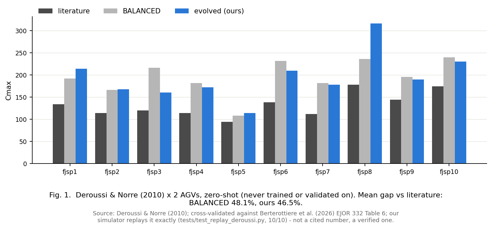

# 보고서 D - Deroussi & Norre zero-shot: Dauzere 계열 우위가 옮겨가지 않는다

실행 `run_deroussi_zeroshot.py`. 결과 `result_deroussi_zeroshot.json`.
LLM 호출 없음(이미 진화된 gen65 번들을 그대로 재사용, 결정론적 1회 통과 10회).

## 결론

1. **Dauzere held-out(45.2%)에서 봤던 진화 규칙의 우위가, 전혀 다른 벤치마크 계열에는
   옮겨가지 않는다.** Deroussi & Norre(2010) 10개 인스턴스, AGV 2대, zero-shot(진화도
   검증도 이 데이터에 한 번도 접촉하지 않음)에서:

   | 번들 | 평균 격차(문헌 대비) |
   |---|---:|
   | MIX (손규칙) | **45.9%** |
   | **evolved gen65 (우리)** | **46.5%** |
   | BALANCED (손규칙) | 48.1% |
   | HAND (손규칙) | 77.8% |

   evolved가 BALANCED를 근소하게 이기지만(-1.6%p), **MIX한테는 진다.** Dauzere held-out에서
   BALANCED 대비 -33%p 우위였던 것과는 전혀 다른 그림이다.

2. **왜 Dauzere와 다른가 - 두 계열의 구조가 다르다.** Dauzere/Berterottière 이동시간
   행렬은 12/15쌍이 비대칭이고 평균 이동(27.0)이 평균 가공(57.0)의 47%로 상당한 비중을
   차지한다(이전 대화에서 01a 행렬로 확인). Deroussi 인스턴스는 저자가 다르고 규모도
   작다(문헌 Cmax 94~178, Dauzere는 수천 단위). 진화된 `vehicle_select`가 `empty_travel`·
   `agv_cum_travel`에 강하게 벌점을 주도록 튜닝됐는데, 이게 Dauzere 특유의 구조(공차가
   비싸고 비대칭)에 맞춰진 것이라면 Deroussi에서는 같은 만큼의 이득을 못 줄 수 있다.
   **이 문단은 가설이다. 다음 실험에서 슬롯별로 확인이 필요하다** (아래 "다음" 참고).

3. **문헌은 여전히 못 이긴다.** 10개 중 0개. Dauzere보다도 격차가 크다(45.2% vs 46.5%,
   거의 같지만 Deroussi 쪽 절대 규모가 훨씬 작아 같은 %가 더 적은 여유를 뜻한다).

## 그림

fjsp5·fjsp7처럼 문헌에 가까운 인스턴스도 있고(evolved가 문헌 대비 +20~24), fjsp8처럼
크게 벌어지는 경우도 있다(+78%, evolved 316 vs 문헌 178) - 인스턴스별 편차가 크다.

## 해석

- **이건 실패가 아니라 정직한 경계 측정이다.** "45.2%"를 방법의 일반 성능이라고 쓰면
  안 되는 이유가 하나 더 늘었다 - 그 숫자는 **Dauzere 계열 안에서의 일반화**만 말한다.
- **긍정적으로 볼 부분**: evolved가 BALANCED를 여전히 이긴다(근소하지만). 완전히
  무너지지 않았다는 뜻이고, 부하분산 뼈대 자체는 Deroussi에서도 어느 정도 유효하다는
  신호다. 다만 MIX한테 지는 건 설명이 더 필요하다.

## 다음

- **원인 조사**: `vehicle_select`의 이동거리 벌점 계수를 Deroussi 스케일에 맞춰
  재정규화하면 격차가 줄어드는지 확인 (같은 번들, 계수만 스케일). 계수가 원인이면
  이건 과적합이 아니라 **단위/스케일 문제**일 수 있다.
- Deroussi에서 처음부터 진화시키면(zero-shot이 아니라 직접 학습) 얼마나 나오는지도
  참고할 가치가 있다 - 단, 그건 새로운 실험이지 이 zero-shot 결과의 대체가 아니다.
- AGV 4·6대 Dauzere 확장과 마찬가지로, "규모/스케일이 다른 계열 간 전이"라는 하나의
  질문으로 묶어 다음 실험 설계에 반영할 것.
